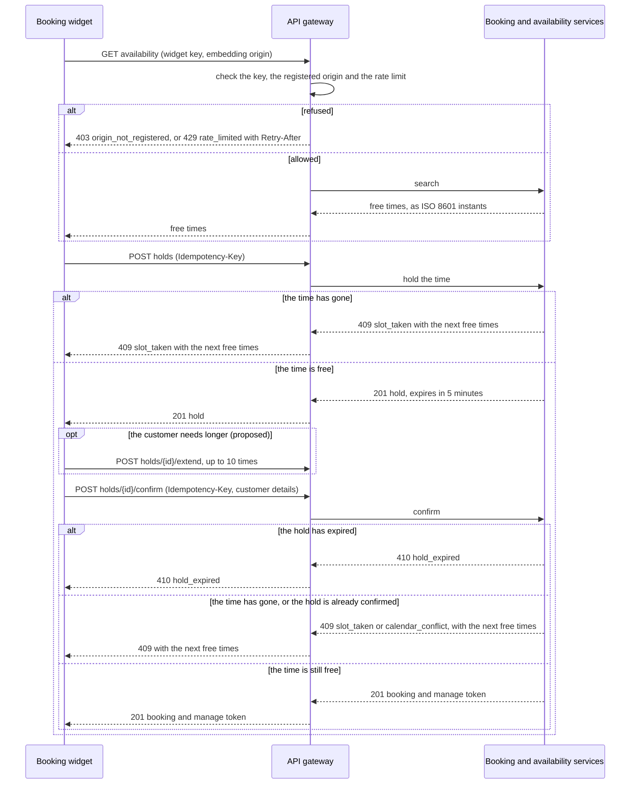

# Booking API

## Purpose

The booking widget, running inside a business's own website, uses this API to show a business's services and free times and to hold, confirm, reschedule and cancel bookings. It is the only way customers book; if it stops, no business on the platform can take a booking online.

## Parties and responsibilities

| Party | System | Responsible for |
|---|---|---|
| Provider | Booking API | Availability, holds and bookings; enforcing business isolation and rate limits; this contract's service levels |
| Consumer | Booking widget | Calling only the operations below; showing every time with its zone; offering alternatives when a slot is taken |

## Interaction

- Pattern: Integration API Management (External). The widget calls across the public internet from a customer's browser, through the API gateway. Why the interface takes this form is recorded in ADR-AB-0002.
- Direction and trigger: widget to API, on each customer action.
- Volume: typical 20 requests per second across all businesses; peak 200 per second (Monday mornings).
- Ordering: not applicable; each request stands alone, and concurrency on a slot is resolved by the provider (see the [booking requirements](../requirements/booking.md)).

## Interaction flows

Finding a time, holding it and confirming it, with the ways a request can be turned away.



1. The widget searches with the business's widget key and the page it is embedded in; the gateway checks the key, the page and the rate limit, and refuses with `403` or `429`. Every request below passes the same checks and can be refused the same way.
2. The customer picks a time; the widget holds it. The hold lasts 5 minutes and can be extended up to 10 times (proposed).
3. The widget confirms with the customer's details and a new `Idempotency-Key`. The services answer `410` if the hold has expired, `409` with the next free times if the time has gone or the hold is already confirmed, and otherwise create the booking.

## Interface specification

- openapi `booking-api/openapi.yaml` v1.2.0 — services, availability search, holds, bookings; authoritative copy: the booking-api repository, published to the API developer portal.
- Design standard followed: resource-oriented REST, JSON, ISO 8601 instants with offsets (see the [availability requirements](../requirements/availability.md)), RFC 9457 problem details for errors.

Operations marked *proposed* were found necessary while building the demo and are not yet agreed by the front-end and platform leads:

| Operation | Purpose |
|---|---|
| `GET /businesses/{businessId}/services` | Services a business offers, with durations |
| `GET /businesses/{businessId}/availability?service=&from=&to=` | Free slots, per staff member, as UTC instants |
| `POST /businesses/{businessId}/holds` | Hold a slot for five minutes |
| `POST /holds/{holdId}/extend` | Add five minutes to a hold, up to ten times (proposed) |
| `DELETE /holds/{holdId}` | Release a hold the customer no longer wants (proposed) |
| `POST /holds/{holdId}/confirm` | Confirm a hold as a booking, with the customer's details |
| `PATCH /bookings/{bookingId}` | Reschedule, using the customer's manage-booking token |
| `DELETE /bookings/{bookingId}` | Cancel, using the customer's manage-booking token |

## Examples

Captured from the running demo (the fictional Example Clinic), shortened only where it says so, and with the response headers other than `traceparent` and `Content-Type` left out. `/v1` is the path prefix, and every time is an ISO 8601 instant.

A hold:

```http
POST /v1/businesses/example-clinic/holds
X-Widget-Key: pk_demo_example_clinic
X-Embedding-Origin: https://clinic.example.org
traceparent: 00-0af7651916cd43dd8448eb211c80319c-00f067aa0ba902b7-01
Idempotency-Key: 5b0d3f6e-7c1a-4d2e-9a58-3e1f0c7b2a64
Content-Type: application/json

{"serviceId": "followup", "staffId": "alex", "start": "2026-09-28T02:30:00.000Z"}
```

```http
HTTP/1.1 201 Created
traceparent: 00-0af7651916cd43dd8448eb211c80319c-414fd98f903ab139-01
Content-Type: application/json

{"id": "hold_d5e1397fa031", "serviceId": "followup", "staffId": "alex", "start": "2026-09-28T02:30:00.000Z", "end": "2026-09-28T03:00:00.000Z", "expiresAt": "2026-09-28T00:05:00.000Z", "serverTime": "2026-09-28T00:00:00.000Z"}
```

Its confirmation (the name, email and phone number are fictional; the phone number is in the range reserved for fiction):

```http
POST /v1/holds/hold_d5e1397fa031/confirm
X-Widget-Key: pk_demo_example_clinic
X-Embedding-Origin: https://clinic.example.org
traceparent: 00-4bf92f3577b34da6a3ce929d0e0e4736-1c2d3e4f5a6b7c8d-01
Idempotency-Key: 8e2c4a91-3b7d-4f60-a1c5-9d0e6b3f7a12
Content-Type: application/json

{"customer": {"name": "Jordan Example", "email": "jordan@example.org", "phone": "0491 570 006"}}
```

```http
HTTP/1.1 201 Created
traceparent: 00-4bf92f3577b34da6a3ce929d0e0e4736-7e7d44ac36472bfa-01
Content-Type: application/json

{"id": "bk_4467814ce615", "holdId": "hold_d5e1397fa031", "status": "confirmed", "serviceId": "followup", "staffId": "alex", "start": "2026-09-28T02:30:00.000Z", "end": "2026-09-28T03:00:00.000Z", "customer": {"name": "Jordan Example", "email": "jordan@example.org", "phone": "0491 570 006"}, "token": "351106ca84511135c6bb220f81f406cf", "notifications": {"status": "queued", "messages": [{"type": "BookingConfirmed", "channel": "email", "status": "pending"}, {"type": "BookingConfirmed", "channel": "sms", "status": "pending"}]}, "serverTime": "2026-09-28T00:00:00.000Z"}
```

The main error, a time that has gone (a second request for the same time):

```http
HTTP/1.1 409 Conflict
traceparent: 00-5ce0b7a1d4f94e2fa8d36b19c07e5d42-a3981b34b8138ead-01
Content-Type: application/problem+json

{"type": "https://www.itarchitecturepatterns.net/samples/appointment-booking/problems/slot_taken", "title": "Conflict", "status": 409, "code": "slot_taken", "detail": "That time is no longer free.", "instance": "POST /v1/businesses/{id}/holds", "alternatives": [{"staffId": "alex", "start": "2026-09-28T03:00:00.000Z", "end": "2026-09-28T03:30:00.000Z"}, {"staffId": "sam", "start": "2026-09-28T03:00:00.000Z", "end": "2026-09-28T03:30:00.000Z"}, {"staffId": "alex", "start": "2026-09-28T03:30:00.000Z", "end": "2026-09-28T04:00:00.000Z"}]}
```

The `type` URL identifies the kind of problem and is not yet served as a page (RFC 9457 allows that). There are no usage headers on the demo's responses; see Service levels.

## Data

- Entities: service, slot, hold, booking, customer contact.
- Classification: Personal information; driven by: customer name, email address and phone number.
- Personal information: customer name, email and mobile number, collected to confirm and remind the customer of their booking and shared only with the business they booked with.
- Residency: stored in Australia.
- Retention: provider keeps bookings and contact details for 24 months after the appointment, then deletes them; the consumer keeps nothing (the widget holds no data beyond the page).

## Security

- Authentication: each request carries the business's public widget key in `X-Widget-Key`, which identifies the business and is restricted to the domains the business registers, and the page it is embedded in in `X-Embedding-Origin` (learned by the widget from the browser, which vouches for it); the gateway answers `403` if that page is not one of the registered domains; manage-booking operations also require the customer's per-booking token, sent in their confirmation message.
- Credential issue and rotation: widget keys are issued in the admin console and rotated by the business at any time; booking tokens are single-purpose and expire when the appointment has passed.
- Authorisation: the gateway resolves the key to one business, and the service scopes every query to it through row-level security (ADR-AB-0005).
- Transport: TLS 1.2 or later; HSTS on the API domain.
- Network path: public internet to the API gateway; nothing behind the gateway is exposed.
- Pattern controls inherited: [Integration API Management (External)](https://www.itarchitecturepatterns.net/patterns/int-api-external); additional controls: registered-origin check on the widget key, bot protection on hold and confirm.

## Service levels

- Availability: 99.9% per month, measured at the API gateway.
- Latency: availability search p95 ≤ 400 ms; confirm p95 ≤ 800 ms (it includes the live calendar check), measured at the gateway.
- Throughput: 50 requests per second per business; beyond it, `429 Too Many Requests` with `Retry-After`.
- Freshness: availability reflects staff calendar changes within 60 seconds, and a confirmation is checked live whenever the calendar provider can be reached (ADR-AB-0003). When it cannot, the booking is confirmed without the check, the skipped check is logged, and the calendar is reconciled when the provider returns; the possible double booking is an accepted risk, recorded in ADR-AB-0003.
- How a consumer learns its limit: from this contract and the developer portal. Beyond it the response is `429 rate_limited` with `Retry-After` and a problem document; neither the response nor the problem names the limit, and there are no usage headers.
- Recovery for the integration: time 1 hour, point 5 minutes (ADR-AB-0006 and the SAD, section 8.2).
- Support hours for these objectives: 24×7.

## Error handling

- Errors and their meaning, each a problem document with a stable `code`:
  - `400` `invalid_request`, `idempotency_key_required`;
  - `401` `unknown_key` (unknown or revoked key);
  - `403` `origin_not_registered`, `token_expired`, `forbidden`;
  - `404` `unknown_business`, `unknown_service`, `unknown_hold`, `unknown_booking`, `unknown_route`, `not_found`;
  - `409` `slot_taken` (the time has gone, or the hold is already confirmed) and `calendar_conflict` (the staff member's own calendar has an event there), both listing the next free times; `too_many_extensions` (proposed, with extending a hold) and `already_confirmed`, which list none;
  - `410` `hold_expired`;
  - `413` `payload_too_large`, `415` `unsupported_media_type`;
  - `422` `idempotency_key_reused`, `not_bookable`, `invalid_request`;
  - `429` `rate_limited`;
  - `500` `internal_error`, `503` temporarily unavailable.
- Timeouts: the widget waits 10 seconds, then shows a retry prompt.
- Retries: the widget retries only safe requests (`GET`) and requests carrying an idempotency key, at most twice, with jittered backoff; it never retries a `409`.
- Idempotency: `POST` requests carry an `Idempotency-Key` header; the provider returns the original result for a repeated key within 24 hours, and answers `422 idempotency_key_reused` if the key is reused for a different request. Confirming a hold that is already confirmed, with a new key, is a `409` listing alternatives, not a second booking.
- Failed messages or files: not applicable; the interaction is synchronous.
- Recovery after an outage: holds that expired during the outage are released; the widget re-runs the customer's last search.
- Holds: a hold lasts five minutes, and the customer can extend it up to ten times (proposed; WCAG 2.2.1 requires a way to extend a time limit) or release it by going back (proposed), so they do not block their own first choice.

## Change and versioning

- Interface versioning: the major version is in the path (`/v1/`); additive changes ship without notice.
- Breaking change means: removing or renaming a field or operation, changing a type or an error code's meaning, or tightening validation.
- Notice before a breaking change or deprecation: 90 days, via the API developer portal and the widget release notes.
- What each consumer relies on: the widget relies on `id`, `expiresAt` and `serverTime` on a hold, `token` on a booking, the `code` values and `alternatives` of a problem document, and the `traceparent` it receives. The demo's API tests check `expiresAt`, `token`, the `code` values, `alternatives` and `traceparent`; the rest are checked in review until the widget has contract tests.
- Changing this ICR: the Booking platform and Booking front-end team leads, together.

### Change log

- 1.2.0 (2026-10-09, agreed by the Booking platform and Booking front-end team leads; drafted 2026-10-04): agreed except the items marked proposed, which are extending and releasing a hold (with the `too_many_extensions` code and acceptance criterion 8); the alert on a skipped live check is planned, not built. The agreement accepts criteria 1 and 9 as not yet proved: the load test and the OpenAPI file are still to be built (owner: Lead back-end engineer; due 2026-10-31). Changes in this version: the error `code` values listed; the embedding origin header named; what the widget relies on; recovery targets; the examples and the criterion that checks them; the decisions list now includes ADR-AB-0007 (cited in Related records).
- 1.1.0 (2026-10-03, agreed): extend and release a hold (proposed); acceptance criteria 7 and 8 (the skipped live check, hold extension); the `409` and `422` cases; the live check that cannot be made.
- 1.0.0 (2026-09-26): the first agreed version.

## Observability

- Correlation identifier: `traceparent` (W3C Trace Context), created by the widget and returned in every response, with the trace id kept and a new span id.
- Logs: gateway access logs and service logs carry the correlation identifier and business id, never customer contact details.
- Metrics and alerts: 5xx rate above 1% for 5 minutes, and p95 latency above target for 10 minutes, page the Booking platform on-call. A skipped live check (ICR-AB-0002) is logged as a warning; an alert on it is planned (ADR-AB-0003, not yet built).
- Log entry shape: `seq`, `at` (milliseconds since the epoch), `component`, `event`, `level`, `ref` (the record the event implements), `traceId`, and a `detail` object holding ids, counts and statuses, never a name, email address, phone number or message body.

## Support and escalation

| Party | Contact | Hours | Escalation |
|---|---|---|---|
| Booking platform team | booking-platform@example.com | 24×7 on-call | Head of engineering |
| Booking front-end team | booking-frontend@example.com | Business hours, Sydney | Booking platform on-call |

Severity levels and response targets: Sev 1 (no bookings possible) 15 minutes; Sev 2 (one business or one operation failing) 1 hour; Sev 3 (degraded) next business day.

## Acceptance criteria

1. A search for one service over seven days returns in under 400 ms at p95 under the typical load. Proved by: the search-latency test in `api.test.mjs`, which runs on an empty server, not under load; the load test is still to be built.
2. Fifty simultaneous confirmations of one hold's slot produce exactly one booking and forty-nine `409` responses listing alternatives. Proved by: the fifty-way race test.
3. A request from a domain not registered for the widget key receives `403`. Proved by: the registered-origin test.
4. A repeated `POST` with the same idempotency key creates nothing new and returns the original result. Proved by: the idempotency test.
5. Every time in every response is an ISO 8601 instant with an offset. Proved by: the time-format test over every response shape.
6. No log line contains a customer's name, email address or phone number. Proved by: the log scan in `api.test.mjs`. The logger also refuses such a field outright, but no test yet exercises that refusal.
7. With the calendar provider unavailable, a confirmation succeeds, the response is the same as when the check passes, and the skipped check appears in the log. Proved by: the provider-outage test.
8. Proposed, with extending and releasing a hold: extending a hold adds five minutes, an eleventh extension is refused, and releasing a hold frees its time at once. Proved by: the hold-extension test.
9. Every request and response shown in Examples is valid against `booking-api/openapi.yaml`. Proved by: not yet automated. It is checked in review until `booking-api/openapi.yaml` exists and a validation step runs in CI.

## Related records

- Pattern: [Integration API Management (External)](https://www.itarchitecturepatterns.net/patterns/int-api-external)
- Decisions: ADR-AB-0001 (embed mechanism), ADR-AB-0002 (API exposure), ADR-AB-0003 (availability source of truth), ADR-AB-0005 (tenancy), ADR-AB-0006 (hosting and recovery), ADR-AB-0007 (data store)
- Requirements: [booking](../requirements/booking.md), [availability](../requirements/availability.md)
