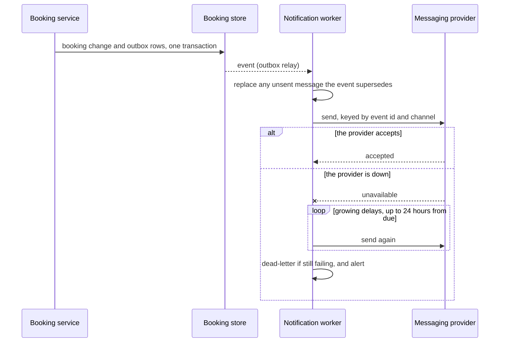

# Notification delivery

## Purpose

Every booking, reschedule and cancellation is confirmed to the customer by email and, where they gave a mobile number, by SMS, with a reminder the day before. This integration takes booking events from the platform's queue and hands messages to an external delivery provider. If it stops, bookings still succeed, but customers are not told about them and more of them miss appointments.

## Parties and responsibilities

| Party | System | Responsible for |
|---|---|---|
| Provider | Email and SMS delivery provider | Accepting messages, delivering them, and reporting delivery status |
| Consumer | Notification worker | Turning booking events into messages, sending each exactly once, and tracking delivery |

## Interaction

- Pattern: Integration Middleware Services (Cloud). Booking events reach the worker through a queue fed by a transactional outbox (see the design notes in the [notification requirements](../requirements/notifications.md)), so the provider's availability never affects booking.
- Direction and trigger: queue to worker to provider, on every booking event and on each reminder's scheduled time; provider to worker for delivery-status callbacks.
- Volume: typical 3 messages per booking (confirmation email, confirmation SMS, reminder); peak 60 messages per second.
- Ordering: per booking, a cancellation supersedes any unsent confirmation or reminder for that booking; across bookings, order does not matter.

## Interaction flows

A booking change reaching a customer, with the messaging provider down.



1. The booking change and the events describing it are written in one transaction and relayed to the worker.
2. The worker drops any unsent message the new event supersedes, then sends each message once, keyed by event id and channel.
3. If the provider is down, the worker retries with growing delays until 24 hours after the message was due, then dead-letters it and alerts.
4. A reminder still unsent less than two hours before the appointment is dropped, not sent late.

## Interface specification

- asyncapi `notifications/asyncapi.yaml` v1.1.0 — the booking events the worker consumes (`BookingConfirmed`, `BookingRescheduled`, `BookingCancelled`, `ReminderDue`); authoritative copy: the notifications repository.
- other: the provider's send API and delivery-status webhooks; authoritative copy: the provider's documentation, pinned by link in the notifications repository.
- Design standard followed: CloudEvents 1.0 envelopes for booking events.

## Examples

Captured from the running demo (the fictional Example Clinic). A booking confirmed, as the event the worker consumes (a CloudEvents 1.0 envelope; the worker makes one message per channel from it, so the same event id appears for email and SMS):

```json
{
  "specversion": "1.0",
  "id": "evt_bk_4467814ce615_confirmed",
  "source": "/booking-service",
  "type": "au.example.booking.BookingConfirmed",
  "subject": "bk_4467814ce615",
  "time": "2026-09-28T00:00:00.000Z",
  "datacontenttype": "application/json",
  "data": {
    "serviceName": "Follow-up",
    "staffName": "Alex",
    "start": "2026-09-28T02:30:00.000Z",
    "end": "2026-09-28T03:00:00.000Z",
    "timeZone": "Australia/Sydney",
    "manageUrl": "https://example.com/manage/bk_4467814ce615?t=351106ca84511135c6bb220f81f406cf",
    "firstName": "Jordan"
  }
}
```

The `manageUrl` carries the booking's manage token, a credential that can reschedule or cancel the booking. It travels to the provider inside the message (see Data).

The main error, a message given up on 24 hours after it was due (the worker's log entry; its shape is in ICR-AB-0001, Observability; it holds no address, phone number or message body):

```json
{"seq": 977, "at": 1790640567000, "component": "notifications", "event": "dead_letter", "level": "alert", "ref": "ICR-AB-0003#error-handling", "traceId": null, "detail": {"businessId": "example-clinic", "bookingId": "bk_4467814ce615", "channel": "email", "reason": "gave_up"}}
```

## Data

- Entities: booking event, message, delivery status.
- Classification: Personal information; driven by: customer name, email address and phone number.
- Personal information: customer first name, email address and mobile number, and the booking's service, staff member's first name and time; shared with the provider solely to deliver the message. The message also carries the manage link, whose token can reschedule or cancel the booking, so the provider must be bound to treat message content as confidential and keep it no longer than its delivery logs (30 days).
- Residency: events and message records stored in Australia; the provider processes messages in the region set in its contract.
- Retention: provider keeps delivery logs for 30 days under its contract; consumer keeps message records for 12 months, without message bodies.

## Security

- Authentication: API key from the provider for sending; signed webhooks from the provider for delivery status.
- Credential issue and rotation: the key is held in the secrets manager and rotated every 90 days, or at once if exposed.
- Authorisation: the key is restricted to sending from the platform's verified sender domain and SMS sender id.
- Transport: TLS 1.2 or later both ways.
- Network path: outbound through the platform's egress to the provider; webhooks inbound through the API gateway with signature validation.
- Pattern controls inherited: [Integration Middleware Services (Cloud)](https://www.itarchitecturepatterns.net/patterns/int-middleware-cloud); additional controls: SPF, DKIM and DMARC on the sender domain.

## Service levels

- Availability: the provider's contracted 99.9% monthly; the consumer queues through provider outages of up to 24 hours.
- Latency: confirmation handed to the provider within 30 seconds of the booking at p95, measured at the worker.
- Throughput: within the provider's contracted rate; beyond it, the worker slows its sending and the queue absorbs the difference.
- Freshness: a reminder is scheduled for 24 hours before the appointment; none is scheduled for a booking made less than 24 hours ahead, and one still unsent less than two hours before the appointment is dropped (see the notification requirements).
- How the consumer learns its limit: from the provider's contracted rate, and its throttling responses, which slow the worker.
- Recovery for the integration: time 1 hour, point 5 minutes. Queued messages are rows beside the booking in the same database and share its recovery point (ADR-AB-0006).
- Support hours for these objectives: 24×7.

## Error handling

- Errors and their meaning: throttled means slow down; invalid recipient means the address or number is unusable and the business is shown it; provider error means retry.
- Timeouts: 10 seconds per send.
- Retries: the worker retries with exponential backoff for up to 24 hours **from when the message became due**, not from when it was queued (a reminder queued days ahead must not be given up on before its time); after that the message goes to the dead-letter queue.
- Idempotency: each message is keyed by event id and channel; the worker records every send and never sends the same key twice.
- Failed messages or files: messages still failing 24 hours after they were due go to the dead-letter queue, shown on the support dashboard, and the business sees "not delivered" against the booking.
- Recovery after an outage: the queue drains in order once the provider returns; a reminder still unsent less than two hours before the appointment is dropped rather than sent late.

## Change and versioning

- Interface versioning: an event type is named in the CloudEvents `type` (`au.example.booking.BookingConfirmed`); new fields are additive, and a breaking change is a new type name (for example `au.example.booking.BookingConfirmedV2`) published beside the old one for the notice period.
- Breaking change means: removing or renaming an event field, changing a field's type or format, or changing an event type's meaning.
- Notice before a breaking change or deprecation: 30 days, via the platform's internal change log (both sides are internal teams).
- What each consumer relies on: the notification worker relies on the CloudEvents attributes and the `data` fields `firstName`, `serviceName`, `staffName`, `start`, `end`, `timeZone` and `manageUrl`; businesses rely on a message being sent once per event and channel.
- Changing this ICR: the Booking platform team lead.

### Change log

- 1.1.0 (2026-10-04, **proposed**; the last agreed version is 1.0.1): the examples (a real envelope, with ISO 8601 times), recovery targets, what the worker relies on, the manage token noted as crossing to the provider, the reminder window stated as in the requirements, a field's type or format change counted as breaking.
- 1.0.1 (2026-10-03): the 24-hour retry limit counts from when a message is due.
- 1.0.0 (2026-09-26): the first agreed version.

## Observability

- Correlation identifier: the booking event's CloudEvents `id`, carried into the provider request as a tag.
- Logs: every send and status callback, with booking id, channel and outcome (the event id is to be added to the entry; until then the entry says which booking and channel, and where logged the event type, but `dead_letter` does not yet say which message); never message bodies or contact details. The entry shape is in ICR-AB-0001, Observability.
- Metrics and alerts: oldest unsent message older than 5 minutes, or more than 2% of sends failing over 15 minutes, alerts the Booking platform on-call.

## Support and escalation

| Party | Contact | Hours | Escalation |
|---|---|---|---|
| Booking platform team | booking-platform@example.com | 24×7 on-call | Head of engineering |
| Messaging provider | Provider support portal | 24×7 per contract | Provider account manager |

Severity levels and response targets: Sev 1 (no messages sending) 15 minutes; Sev 2 (one channel failing) 1 hour; Sev 3 (delays under 1 hour) next business day.

## Acceptance criteria

1. With the provider unavailable, bookings succeed; when it returns, every pending message is sent exactly once. Proved by: the provider-outage test.
2. A booking cancelled before its confirmation is sent produces a cancellation message and no confirmation. Proved by: the supersession test.
3. A reminder whose window passed during an outage is not sent late. Proved by: the late-reminder test.
4. Replaying the same booking event sends nothing new. Proved by: the replay test.
5. No log line contains a message body, email address or phone number. Proved by: the log scan.
6. The event example in Examples is valid against `notifications/asyncapi.yaml`, and the log entry has the shape given in ICR-AB-0001. Proved by: not yet automated; checked in review until `notifications/asyncapi.yaml` exists and a step in CI validates the examples against it.

## Related records

- Pattern: [Integration Middleware Services (Cloud)](https://www.itarchitecturepatterns.net/patterns/int-middleware-cloud)
- Decisions: ADR-AB-0006 (hosting and recovery), ADR-AB-0007 (data store: the outbox is a table beside the booking)
- Requirements: [notifications](../requirements/notifications.md), with the design notes on the outbox
