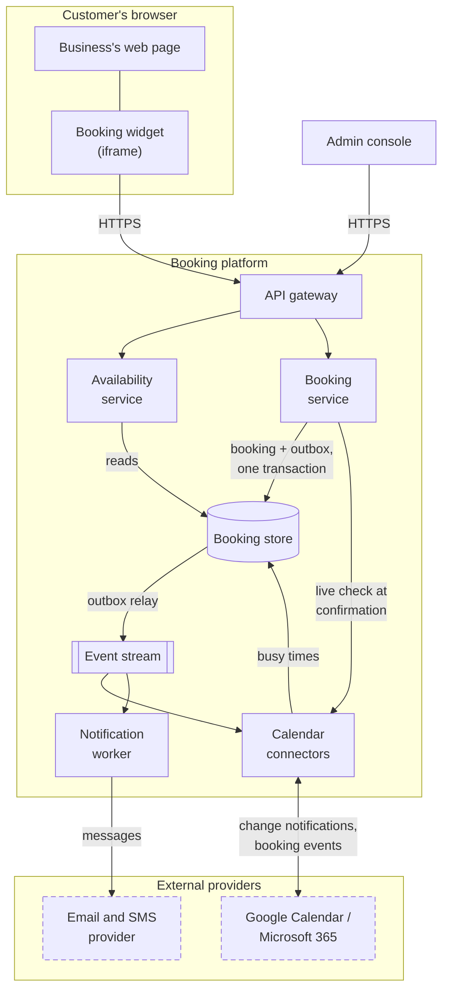
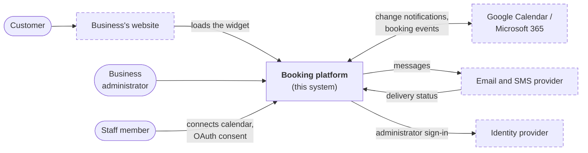
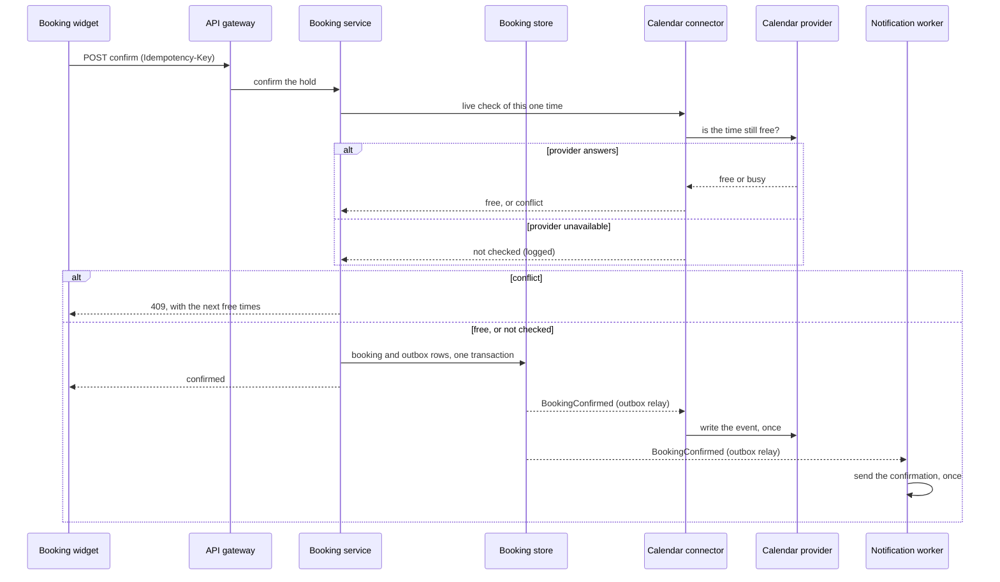
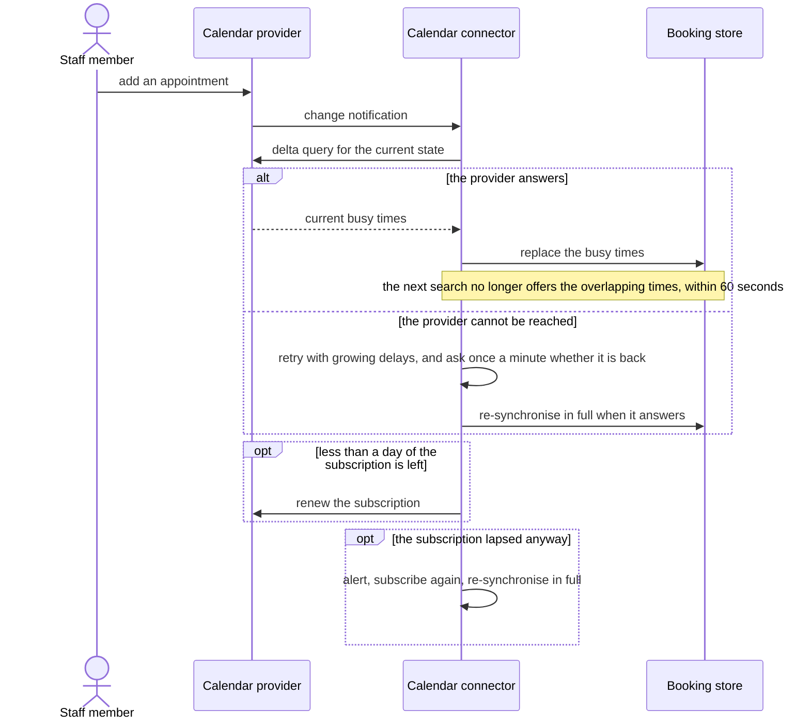
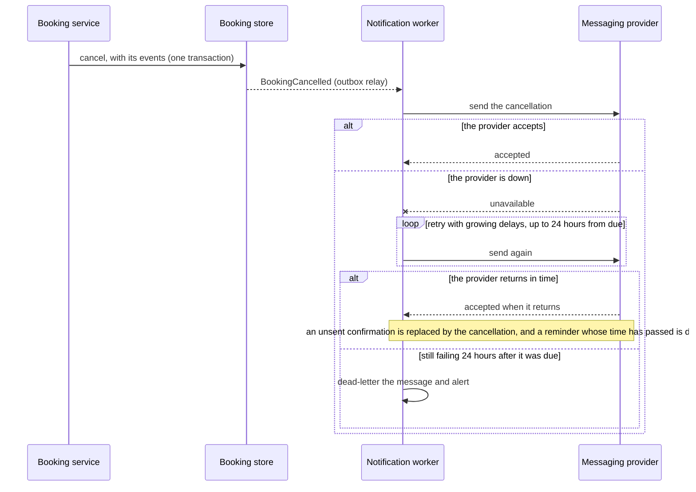

# Solution Architecture Design (SAD): Appointment Booking (sample)

## Document Control

### Version History

| Version | Date | Author | Change |
| :--- | :--- | :--- | :--- |
| 0.1 | 2026-09-12 | Solution architect | First draft for review |
| 1.0 | 2026-09-26 | Solution architect | Endorsed at architecture review; decisions ADR-AB-0001 to 0006 accepted |
| 1.1 | 2026-10-02 | Solution architect | Decisions re-cut: API exposure, calendar integration and the data store recorded (ADR-AB-0002, 0004, 0007); the double-booking rule and time handling moved out of the decisions into the requirements, which are now specified with scenarios |
| 1.2 | 2026-10-02 | Solution architect | Only major decisions kept as ADRs: notification delivery is a design note; hosting, compute and recovery (the run cost and the recovery risk) recorded as ADR-AB-0006; calendar integration reframed as build versus buy |
| 1.3 | 2026-10-03 | Solution architect | Stakeholders and concerns, ranked quality goals, constraints, system context, runtime view, cross-cutting concerns, risks and glossary added; the calendar-outage behaviour settled as confirm-and-reconcile (ADR-AB-0003); hold extension and release, and the subscription renewal schedule, brought into the contracts after the working demo found them missing |
| 1.4 | 2026-10-09 | Solution architect | Interface contract status table (section 5.2) refreshed: ICR-AB-0001 agreed at 1.2.0 and ICR-AB-0003 at 1.1.0 (agreed by the team leads, 2026-10-09), ICR-AB-0002 still proposed; hold extension and release marked proposed where they are mentioned; the Testing row and section 10 name the criteria not yet proved (the load test, the OpenAPI file, the AsyncAPI file, the calendar-sync schema) |

### Approvals

| Role | Decision | Date |
| :--- | :--- | :--- |
| Architecture review | Endorsed, with the condition recorded in ICR-AB-0002 (subscription renewal) | 2026-09-26 |
| Security architect | Approved | 2026-09-25 |
| Product owner | Approved | 2026-09-25 |

## 1. Executive Summary

### 1.1 Problem Statement

Small service businesses (physiotherapists, clinics, salons, advisers) take most bookings by phone. Staff answer calls between clients, customers can't book outside opening hours, and bookings kept in several places produce clashes and no-shows. Existing booking tools either take customers away to another website or ask the business to move its staff onto a new calendar.

### 1.2 Proposed Solution Summary

A booking service that a business adds to its own website with one snippet. Customers see real availability, drawn from staff members' own calendars, and book, reschedule or cancel themselves. Staff keep using Google Calendar or Microsoft 365; bookings appear there automatically, and customers get confirmations and reminders by email and SMS. One service hosts many businesses, each isolated from the rest.

### 1.3 Target State Outcomes

| Outcome | Measure | Target |
| :--- | :--- | :--- |
| Fewer booking calls | Share of bookings made online | 60% within six months of go-live |
| No double bookings | Overlapping bookings for one staff member | Zero, enforced by design |
| Fewer no-shows | No-show rate after reminders | Down 30% on the business's baseline |
| Fast onboarding | Time from sign-up to taking a first booking | Under 30 minutes, without our help |

### 1.4 Stakeholders and Concerns

| Stakeholder | Concern | Addressed in |
| :--- | :--- | :--- |
| Business owner | Fewer phone calls, no double bookings, staff keep using their own calendars | 1.3, 2.1, 3 (ADR-AB-0003, 0004), 4.4 |
| Customer | Booking without an account; times shown in their own zone; usable with a keyboard and a screen reader; personal details kept private | 2.1, 2.2, 6.3, 9 |
| Staff member | Their calendar stays theirs; the platform sees only busy times and asks for the narrowest access | 5.2, 7.1, 6.3 |
| Business administrator | Setting up services and hours without help; knowing when a calendar has stopped synchronising | 2.1 (FR-6), 9, 10 |
| Website owner | Adding the widget with one snippet, and being sure it cannot read what customers type or break the page | 2.1 (FR-7), 3 (ADR-AB-0001), 7.3 |
| Product owner | The outcomes in 1.3, the running cost, and knowing which risks they have accepted | 1.3, 3 (ADR-AB-0006), 10 |
| Security architect | Isolation between businesses, least privilege, no personal data in logs | 3 (ADR-AB-0005), 7, 9 |
| Platform engineer on call | A system a small team can run, alerts that mean something, and a recovery that has been rehearsed | 8, 9, 10 |

## 2. Business Context & Requirements

Each requirement below is specified, with checkable scenarios, in [requirements/](requirements/): [booking](requirements/booking.md), [availability](requirements/availability.md) and [notifications](requirements/notifications.md).

### 2.1 Key Functional Requirements

| Id | Requirement |
| :--- | :--- |
| FR-1 | A customer can see free slots for a service, by staff member or "anyone", over the coming weeks, in their own time zone. |
| FR-2 | A customer can hold a slot while entering their details, and confirm it without creating an account. |
| FR-3 | A customer can reschedule or cancel using the link in their confirmation message. |
| FR-4 | A staff member's own calendar appointments make them unavailable, and every booking appears in their calendar. |
| FR-5 | Customers receive a confirmation, a reminder the day before, and a message on any change. |
| FR-6 | A business administrator sets services, durations, staff, working hours, booking notice and cancellation rules. |
| FR-7 | A website owner adds the widget with one snippet and sets its brand colour. |

### 2.2 Non-Functional Requirements (NFRs)

| Quality | Requirement | Priority |
| :--- | :--- | :--- |
| Correctness | No overlapping bookings for one staff member, under any concurrency | Goal |
| Isolation | No business can read another business's data | Goal |
| Availability | Booking API 99.9% per month | Goal |
| Privacy | Personal information limited to what a booking needs; stored in Australia; deleted 24 months after the appointment | Goal |
| Freshness | Staff calendar changes reflected in availability within 60 seconds | Important |
| Performance | Availability search p95 ≤ 400 ms; confirm p95 ≤ 800 ms | Important |
| Accessibility | WCAG 2.2 AA for the widget and the admin console | Important |
| Scalability | 200 requests per second at peak across all businesses; 50 per business | Standard |

Where goals pull against each other, correctness comes first for a single booking and availability comes first when a third party fails: a provider outage may degrade a search, and never stops a booking (ADR-AB-0003).

### 2.3 Scope Boundaries

- **In scope:** the widget, the Booking API, availability and booking, calendar synchronisation, notifications, the admin console, multi-business hosting.
- **Out of scope:** payments and deposits, waiting lists, group classes, staff rostering, reporting and analytics, native mobile apps.
- **Constraints:**
  - Personal information is stored in Australia (the product owner's commitment to customers).
  - Staff calendars stay with their provider; businesses will not move staff onto a new calendar (the business owners' stated condition for adopting the product).
  - The widget runs on websites the platform does not control (the business model).
  - The platform is run by one small team on call 24×7 (head of engineering).
  - The widget and admin console meet WCAG 2.2 AA (product policy).
- **Assumptions:** staff calendars are in Google Calendar or Microsoft 365; businesses operate in Australia and New Zealand at launch. Each is a risk in section 10 until confirmed.

## 3. Architecture Decisions (ADR Linkage)

| Decision | Summary | Quality goal served | Record |
| :--- | :--- | :--- | :--- |
| Embed mechanism | The widget runs in an iframe loaded by a small script, so the host page can't read what customers type | Privacy; gives up some freedom to style it from the host page | [ADR-AB-0001](decisions/0001-embed-mechanism.md) |
| API exposure | A public REST API behind a gateway, identified by a widget key tied to the domains a business registers | Availability and isolation, through rate limits and the key; gives up trusting the browser | [ADR-AB-0002](decisions/0002-api-exposure.md) |
| Availability source of truth | Search reads a synchronised copy of busy times; confirmation checks the calendar live, and proceeds unchecked if the provider is down | Correctness and availability; gives up an occasional rejected pick, and accepts a possible double booking during a provider outage | [ADR-AB-0003](decisions/0003-availability-source-of-truth.md) |
| Calendar integration | Build connectors on each provider's own API and change notifications rather than buy an aggregation platform, so cost does not grow with every calendar | Freshness and running cost; gives up engineering time | [ADR-AB-0004](decisions/0004-calendar-integration.md) |
| Multi-tenancy | One shared database with row-level security per business | Isolation; gives up per-business separation of load | [ADR-AB-0005](decisions/0005-multi-tenancy.md) |
| Hosting, compute and recovery | Containers in one Australian region across three zones, recoverable into a second region from code and backups | Availability at a proportionate cost; gives up a fast regional recovery | [ADR-AB-0006](decisions/0006-hosting-and-recovery.md) |
| Data store | A managed PostgreSQL database, which can enforce no-overlap, isolation and the outbox itself | Correctness and isolation; gives up a choice of stores | [ADR-AB-0007](decisions/0007-data-store.md) |

These are the decisions that shape the whole system: hard or costly to reverse, committing money or a vendor, or fixing a major quality. The no-overlap rule, the five-minute hold, the handling of time zones and the way notifications are delivered are **requirements and design**, not decisions: they say what must be true, with scenarios, in the [booking](requirements/booking.md), [availability](requirements/availability.md) and [notifications](requirements/notifications.md) requirements. The decisions above are how the design makes them true.

## 4. System & Component Model

### 4.1 Logical Architecture Diagram

### 4.2 Component Catalog

| Component | Responsibility | Owned by |
| :--- | :--- | :--- |
| Booking widget | Search, hold, confirm, reschedule and cancel for customers, inside an isolated frame | Booking front-end team |
| Admin console | Business set-up: services, staff, hours, rules, calendar connections | Booking front-end team |
| API gateway | TLS, widget-key and origin checks, per-business rate limits, routing | Booking platform team |
| Availability service | Free slots from rules, busy times, holds and bookings | Booking platform team |
| Booking service | Holds, live check, bookings, changes; writes outbox events | Booking platform team |
| Booking store | Businesses, services, staff, rules, holds, bookings, busy times, outbox | Booking platform team |
| Event stream | Booking events to their consumers | Booking platform team |
| Calendar connectors | Busy-time synchronisation and writing bookings to staff calendars | Booking platform team |
| Notification worker | Confirmation, reminder and change messages, exactly once | Booking platform team |

### 4.3 System Context & External Neighbours

| Neighbour | Kind | Exchange | Contract |
| :--- | :--- | :--- | :--- |
| Customer (in a browser, on the business's website) | User | Searches, holds, books and manages bookings; receives confirmations and reminders | [ICR-AB-0001](contracts/ICR-AB-0001-booking-api.md), [ICR-AB-0003](contracts/ICR-AB-0003-notifications.md) |
| Business's website | External system | Loads the widget's script and gives it a frame; learns nothing of what customers type | [ADR-AB-0001](decisions/0001-embed-mechanism.md) |
| Business administrator | User | Sets up services, staff, hours and rules; sees whether each calendar is in step | None: the admin console's own screens |
| Staff member | User | Connects their calendar with OAuth consent; sees bookings appear in it | [ICR-AB-0002](contracts/ICR-AB-0002-calendar-sync.md) |
| Google Calendar, Microsoft 365 | Provider | Change notifications and busy times in; booking events out | [ICR-AB-0002](contracts/ICR-AB-0002-calendar-sync.md) |
| Email and SMS delivery provider | Provider | Messages out; delivery status in | [ICR-AB-0003](contracts/ICR-AB-0003-notifications.md) |
| Identity provider | Provider | Administrator sign-in with multi-factor authentication | None: standard OpenID Connect |

### 4.4 Runtime View

The three scenarios below are the ones the design most depends on. Each runs in the sample's working demo, whose "Behind the scenes" panel names each step's component and links to its record.

#### Book a time

- **Trigger:** a customer on a business's website chooses a service and a time.
- **Normal path:**
  1. The widget (in its frame) tells the API which page embeds it, and asks the API gateway for free times, with the business's widget key.
  2. The gateway checks the key and the embedding page, applies the rate limit, and passes the request to the availability service for that business only.
  3. The availability service builds the free times from working hours, the synchronised busy times, holds and bookings, and returns them as UTC instants.
  4. The customer picks one. The booking service holds it for five minutes; the database refuses the hold if it overlaps another.
  5. The customer enters their details and confirms, with an idempotency key. The booking service asks the calendar connector to check that one time against the staff member's own calendar.
  6. In one transaction the booking service turns the hold into a booking and writes the events to publish (the outbox). The relay publishes them.
  7. The calendar connector writes the booking into the staff member's calendar, once; the notification worker sends the confirmation, once.
- **When two customers choose the same time:** the database refuses the second hold, or the second confirmation. That customer is told the time is taken and is offered the next free times at once. No messages are queued for a booking that did not happen.
- **When the calendar provider is unavailable at step 5:** the check cannot be made, so the booking is confirmed anyway, the skipped check is logged, and the calendar is reconciled when the provider returns. A double booking against an event the platform had not seen is possible; it is accepted deliberately ([ADR-AB-0003](decisions/0003-availability-source-of-truth.md)).
- **When the customer is slow:** the hold can be extended up to ten times (proposed), and the customer can let it go by going back (proposed). An expired hold frees the time.

#### A staff member's calendar changes

- **Trigger:** a staff member adds, moves or removes an appointment in their own calendar.
- **Normal path:**
  1. The provider sends a change notification to the platform.
  2. The calendar connector treats it as "something changed", asks the provider for the current state of that calendar, and replaces the stored busy times.
  3. The next search no longer offers the overlapping times, within 60 seconds.
- **When a notification is lost, or the subscription has lapsed:** the connector renews each subscription when less than a day of it remains. A subscription that lapses anyway raises an alert, is created again, and the calendar is re-synchronised in full. A full re-synchronisation also runs every 24 hours as the safety net.
- **When the provider is unreachable:** the connector retries with growing delays, and asks the provider once a minute whether it is back. When it answers, the calendar is re-synchronised and pending writes retried at once, so no one waits out a long delay.

#### A booking changes while the messaging provider is down

- **Trigger:** a customer cancels, or reschedules, a booking.
- **Normal path:** the change and its events are committed together; the relay publishes them; the notification worker sends a message for each, keyed by event and channel so a repeat sends nothing.
- **When the messaging provider is down:** the booking change still succeeds. Messages wait in the queue and are retried; each is given up on only 24 hours after it was due. When the provider returns, the queue drains, a cancellation replaces any confirmation not yet sent, and a reminder whose time has passed is dropped rather than sent late.

### 4.5 Alignment with the Reference Architectures

A reference architecture belongs to a domain, not to one system, so this system is placed on the site's enterprise-level [Integration](https://www.itarchitecturepatterns.net/reference-architectures/integration-refence-architecture) and [Data Platform](https://www.itarchitecturepatterns.net/reference-architectures/data-platform-reference-architecture) reference architectures, by their component ids.

| Component | Integration reference architecture | Data platform reference architecture |
| :--- | :--- | :--- |
| Booking widget | Consumers → Web Sites (`websites`) | — |
| Admin console | Consumers → Web Sites (`websites`) | — |
| API gateway | Integration → API Management (`api-mgmt`); Governance → API Developer Portal (`api-portal`); Security → Policy Enforcement (`policy-enforce`) | — |
| Availability service | Producers → Internal IT Systems (`prod-internal-it`) | Data Sources → Operational Databases (`op-db`) |
| Booking service | Producers → Internal IT Systems (`prod-internal-it`) | Data Sources → Operational Databases (`op-db`) |
| Booking store | Information → Data Definition & Modelling (`data-model`) | Data Storage → Purpose-Built Databases (`purpose-built-db`) |
| Event stream | Integration → Event Streaming (`event-stream`) | Data Storage → Streaming Broker (`stream-broker`) |
| Calendar connectors | Integration → Native / Connector Integration (`native-connector`) | — |
| Notification worker | Integration → Middleware Services (ESB) (`middleware`) | — |

**Gaps.** The availability and booking services are applications rather than integration or data capabilities, so the reference architectures place them only as producers.

## 5. Integration & Interface Design

### 5.1 Integration Patterns Used

| Integration | Pattern | Why this pattern |
| :--- | :--- | :--- |
| Widget → Booking API | [Integration API Management (External)](https://www.itarchitecturepatterns.net/patterns/int-api-external) | Callers are browsers on the public internet, outside the trust boundary |
| Booking domain → consumers | [Integration Event Streaming (Internal)](https://www.itarchitecturepatterns.net/patterns/int-esp-internal) | One booking event feeds several consumers without the domain knowing them |
| Calendar synchronisation | [Integration Native Connectors (Cloud)](https://www.itarchitecturepatterns.net/patterns/int-native-cloud) | Both providers offer supported APIs and change feeds; a generic layer would add cost, not capability |
| Notifications | [Integration Middleware Services (Cloud)](https://www.itarchitecturepatterns.net/patterns/int-middleware-cloud) | A queue keeps a SaaS provider's outages from reaching bookings |

### 5.2 API Specifications & Contracts

| Contract | Interaction | Status |
| :--- | :--- | :--- |
| [ICR-AB-0001 Booking API](contracts/ICR-AB-0001-booking-api.md) | Synchronous request/response; OpenAPI | Agreed at 1.2.0 (2026-10-09); extending and releasing a hold remain proposed |
| [ICR-AB-0002 Calendar synchronisation](contracts/ICR-AB-0002-calendar-sync.md) | Change notifications and delta queries | Proposed at 0.11.0 — renewal schedule designed and shown working; it stays proposed until the platform lead agrees the renewal schedule and alert and they are tried against a real provider (open issue, due 2026-10-31) |
| [ICR-AB-0003 Notification delivery](contracts/ICR-AB-0003-notifications.md) | Asynchronous messages; AsyncAPI and CloudEvents | Agreed at 1.1.0 (2026-10-09) |

## 6. Data Architecture

### 6.1 Data Model / Schema

| Entity | Key attributes | Notes |
| :--- | :--- | :--- |
| Business | id, name, time zone, widget key, registered origins | The tenant; every other entity carries its id |
| Service | id, business, name, duration, buffer | |
| Staff member | id, business, first name, calendar connection | |
| Working-hour rule | staff member, weekday, local start, local end, effective dates | Local time in the business's zone ([availability requirements](requirements/availability.md)) |
| Busy interval | staff member, start, end | UTC; synchronised; no titles or attendees (ADR-AB-0003) |
| Hold | id, staff member, service, time range, expires at | Five-minute life ([booking requirements](requirements/booking.md)) |
| Booking | id, staff member, service, time range, customer contact, status, manage token | Time range is a UTC range under the overlap constraint |
| Outbox event | id, type, payload, created at, published at | Written in the same transaction as its booking change ([notification requirements](requirements/notifications.md)) |

### 6.2 Data Storage Technology Map

| Data | Store | Why |
| :--- | :--- | :--- |
| Everything in 6.1 | Managed PostgreSQL ([ADR-AB-0007](decisions/0007-data-store.md)) with row-level security and range-exclusion constraints | One store gives transactions for booking-plus-outbox, the overlap guarantee and tenant isolation together |
| Booking events in flight | Event stream | Retains events for consumers to catch up after an outage |
| Tokens and keys | Secrets manager | Encrypted, access-audited, rotated |

### 6.3 Data Lifecycle & Security

- **Personal information:** customer name, email and mobile number, collected to confirm and remind; shared only with the booked business and, for delivery, the messaging provider.
- **Retention:** bookings and contact details are deleted 24 months after the appointment; past busy intervals nightly; message records after 12 months, without bodies.
- **Residency:** stored in Australia.
- **Encryption:** at rest by the database and secrets manager; in transit with TLS 1.2 or later everywhere.
- **Isolation:** row-level security by business on every table (ADR-AB-0005), tested on every build.

## 7. Security & Compliance Controls

### 7.1 Authentication & Authorization

- **Customers** don't sign in. Booking is authorised by the business's widget key plus a registered-origin check; changing a booking needs the per-booking token from the confirmation message.
- **Business administrators** sign in to the admin console with an identity provider, with multi-factor authentication required.
- **Staff calendars** are connected by each staff member through OAuth 2.0 consent, with the narrowest scopes each provider offers.
- **Services** authenticate to each other with workload identity, never shared secrets.

### 7.2 Network Security

- Only the API gateway and the admin console are reachable from the internet.
- Services, the database and the event stream sit in private networks; outbound calls to providers leave through a controlled egress.
- The widget sets a strict Content Security Policy inside its frame, and validates the origin of every message it exchanges with the loader.

### 7.3 Threat Model & Mitigation

| Threat | Mitigation |
| :--- | :--- |
| A script on the host page reads customer details | The form runs in an isolated iframe (ADR-AB-0001) |
| A defect exposes one business's data to another | Row-level security in the database, tested on every build (ADR-AB-0005) |
| Automated abuse holds every slot | Per-business rate limits, bot protection on hold and confirm, five-minute hold expiry |
| A stolen widget key used from another site | The key works only from the business's registered origins, and can be rotated at once |
| Calendar tokens leaked | Stored only in the secrets manager, minimum scopes, revocable from the admin console |
| Message spoofing from our domain | SPF, DKIM and DMARC on the sender domain |

## 8. Deployment & Infrastructure

### 8.1 Target Environment Specifications

| Element | Specification |
| :--- | :--- |
| Hosting | A single cloud region in Australia, across three availability zones ([ADR-AB-0006](decisions/0006-hosting-and-recovery.md)) |
| Compute | Containerised services, scaled on request rate; notification and calendar workers scaled on queue depth |
| Database | Managed relational database, multi-zone, with point-in-time recovery |
| Delivery | CI/CD with automated tests, including the isolation and concurrency tests, on every change; infrastructure as code |
| Environments | Development, test with synthetic businesses, production |

### 8.2 Disaster Recovery (DR) & Business Continuity

| Measure | Target | How |
| :--- | :--- | :--- |
| Recovery point objective | 5 minutes | Point-in-time database recovery; events retained on the stream for 7 days |
| Recovery time objective | 1 hour | Infrastructure as code redeploys to a second region from backups ([ADR-AB-0006](decisions/0006-hosting-and-recovery.md)) |
| Provider outage (calendar) | No booking impact | Search from the synchronised copy; confirmation proceeds without the live check, the skip is logged (an alert on it is planned), and the calendar is reconciled when the provider returns; a possible double booking is an accepted risk ([ADR-AB-0003](decisions/0003-availability-source-of-truth.md)) |
| Provider outage (messaging) | No booking impact | Messages queue for up to 24 hours ([notification requirements](requirements/notifications.md)) |
| Recovery test | Twice a year | Restore to the second region and run the booking acceptance tests |

## 9. Cross-cutting Concerns

| Concern | How the design handles it |
| :--- | :--- |
| Observability | Every request carries a W3C `traceparent`, created by the widget and returned in each response, so a booking can be followed from the browser to the calendar and the message. Logs are structured, carry the business id, and never hold a customer's name, email or phone number, or a calendar event's title or attendees; the logger refuses such a field. Alerts: error rate and latency on the API; age of the oldest unsynchronised calendar change; oldest unsent message; a skipped live check (planned, ADR-AB-0003); a missed subscription renewal ([ICR-AB-0001](contracts/ICR-AB-0001-booking-api.md), [ICR-AB-0002](contracts/ICR-AB-0002-calendar-sync.md), [ICR-AB-0003](contracts/ICR-AB-0003-notifications.md)) |
| Error handling and retries | Errors reach callers as RFC 9457 problem documents with the codes each contract lists. Only safe requests, or ones with an idempotency key, are retried, at most twice with jitter; a conflict is never retried. Calls to providers back off exponentially, and a failing provider is probed once a minute so recovery is not delayed. Messages are retried for 24 hours from when they were due, then dead-lettered and shown to the business |
| Time and time zones | Every booking is one UTC instant; working hours are kept in the business's own zone and follow its clock changes; every time on the wire is ISO 8601 with an offset ([availability requirements](requirements/availability.md)) |
| Accessibility | The widget and admin console meet WCAG 2.2 AA: real form controls, a single Tab stop for the day-and-time grid with arrow-key movement, errors tied to their fields, announcements for changes, and a hold the customer can extend (proposed). Checked on every build with an automated rules engine and a keyboard-only booking, change and cancellation; a check with a real screen reader is still to be done before launch (section 10) |
| Testing | Each requirement scenario and each contract acceptance criterion has an automated test, except ICR-AB-0001 criteria 1 (load) and 9, ICR-AB-0003 criterion 6 and ICR-AB-0002 criterion 8 (no schema yet; that contract is proposed), which wait for the load test, the OpenAPI and AsyncAPI files and the calendar-sync schema (section 10); the database's refusal of overlaps and the isolation between businesses are tested directly, on every build, including by going round the application; a fifty-way race on one time must give exactly one booking. Load against the latency targets has not yet been measured (section 10) |

## 10. Risks, Assumptions & Technical Debt

| Item | Kind | Likelihood and impact | Treatment | Owner |
| :--- | :--- | :--- | :--- | :--- |
| A double booking made while the calendar provider is down | Risk | Low likelihood, a lost appointment for one customer when it happens | Accept; the skipped check is logged and an alert on it is planned, so the business can look; the product owner records acceptance ([ADR-AB-0003](decisions/0003-availability-source-of-truth.md)) | Product owner |
| A change subscription lapses and updates silently stop | Risk | Medium likelihood, stale availability for one staff member | Mitigate: renew a day ahead, alert on a lapse, daily full re-synchronisation ([ICR-AB-0002](contracts/ICR-AB-0002-calendar-sync.md)) | Lead back-end engineer |
| Loss of the whole region | Risk | Very low likelihood, about an hour's outage and five minutes of lost bookings | Accept; the product owner records acceptance; recovery rehearsed twice a year ([ADR-AB-0006](decisions/0006-hosting-and-recovery.md)) | Product owner |
| A provider retires an API version or a scope | Risk | Medium likelihood over the life of the product, a connector stops working | Mitigate: pin versions, review their notices quarterly | Lead back-end engineer |
| One business's traffic starves the others | Risk | Low likelihood, slower service for other businesses | Mitigate: per-business rate limits of 50 requests a second | Platform engineer |
| Staff calendars are all Google Calendar or Microsoft 365 | Assumption | If wrong, a third connector is needed and the build-versus-buy case is reopened ([ADR-AB-0004](decisions/0004-calendar-integration.md)) | Confirm with the first ten businesses | Product owner |
| New Zealand businesses can be served from Australian storage | Assumption | If wrong, a second region and a data-residency decision are needed | Confirm with the privacy officer before launch | Security architect |
| Bot protection on holds and confirmations is specified but not built | Technical debt | The rate limit is the only defence until it is | Build before public launch | Booking platform team |
| Load against the latency targets has not been measured | Technical debt | The targets are unproven at 200 requests a second | Load test, due 2026-10-31 (ICR-AB-0001 criterion 1) | Lead back-end engineer |
| The OpenAPI and AsyncAPI files and the calendar-sync schema do not exist yet | Technical debt | Criteria that check the contracts' examples against them (ICR-AB-0001 criterion 9, ICR-AB-0003 criterion 6, ICR-AB-0002 criterion 8) are checked in review only | Write the files and the schema and validate the examples in CI, due 2026-10-31 | Lead back-end engineer |
| Screen-reader testing of the widget and console has not been done | Technical debt | Automated tools find only part of the problems | Test with NVDA and VoiceOver before launch | Booking front-end team |

## 11. Glossary

| Term | Meaning in this document |
| :--- | :--- |
| Booking | A confirmed appointment for one customer with one staff member, as one UTC time range |
| Business | A tenant: one organisation that uses the platform, with its own staff, services and data |
| Busy interval | A period when a staff member is unavailable, copied from their calendar without any title or attendee |
| Hold | A time reserved for five minutes, so a customer can enter details without losing it |
| Live check | Asking the staff member's calendar, at confirmation, whether the one chosen time is still free |
| Outbox | Rows, written in the same transaction as a booking change, that describe the events to publish |
| Reconcile | To bring the calendar and the bookings back into agreement after a gap, such as an outage |
| Subscription | A provider's standing promise to notify the platform when a calendar changes; it expires and must be renewed |
| Widget key | The public identifier of a business, valid only from the websites it registered |
| Idempotency key | A value a caller sends with a request so that repeating it has no further effect |
