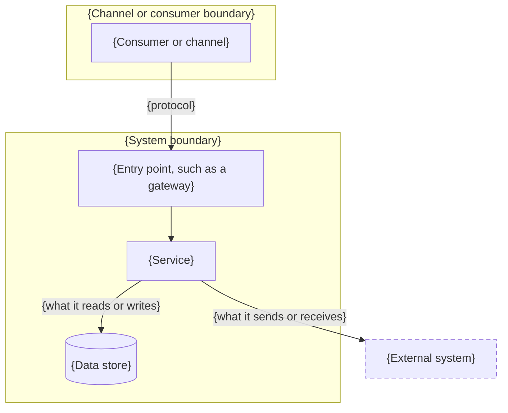
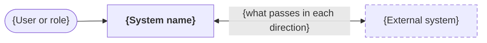
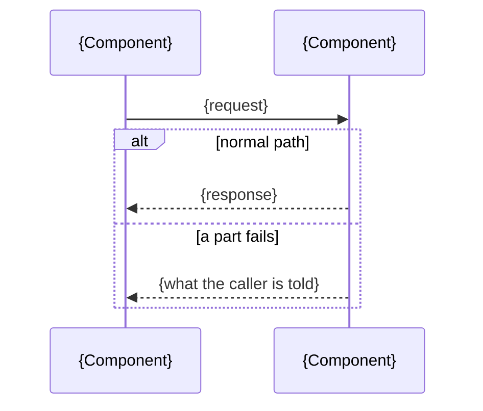

# Solution Architecture Design (SAD): {system or solution name}

<!-- Replace every {…} with your own content. Keep the numbered headings: reviewers, and the linter,
rely on them. A section that doesn't apply says "Not applicable: {reason}" rather than disappearing.
A worked example is on the template's page. -->

## Document Control

### Version History

| Version | Date | Author | Change |
| :--- | :--- | :--- | :--- |
| {0.1} | {YYYY-MM-DD} | {name / role} | {first draft for review} |

### Approvals

| Role | Decision | Date |
| :--- | :--- | :--- |
| {e.g., Architecture review} | {endorsed / endorsed with conditions / not endorsed} | {YYYY-MM-DD} |
| {e.g., Security} | {…} | {…} |

## 1. Executive Summary

### 1.1 Problem Statement

{The business problem or opportunity in two or three sentences: who is affected, what it costs them today, and why now.}

### 1.2 Proposed Solution Summary

{What the solution does and how it resolves the problem, in plain terms. Name capabilities rather than products.}

### 1.3 Target State Outcomes

| Outcome | Measure | Target |
| :--- | :--- | :--- |
| {what changes for the business} | {how you will know} | {the number, and by when} |

### 1.4 Stakeholders and Concerns

<!-- A concern is something a stakeholder needs the design to get right. A concern no section addresses is a gap; a section no concern needs is probably padding. -->

| Stakeholder | Concern | Addressed in |
| :--- | :--- | :--- |
| {role, e.g., Product owner} | {what they need the design to get right} | {section numbers} |

## 2. Business Context & Requirements

### 2.1 Key Functional Requirements

| Id | Requirement |
| :--- | :--- |
| {FR-1} | {a requirement that shaped the architecture, not every feature} |

### 2.2 Non-Functional Requirements (NFRs)

| Quality | Requirement | Priority |
| :--- | :--- | :--- |
| {e.g., Availability} | {a measurable target, and where it is measured} | {goal, important or standard} |
| {e.g., Performance} | {…} | {…} |
| {e.g., Privacy} | {…} | {…} |

<!-- Name the three to five qualities that matter most as "goal". When two goals pull against each other, the design chooses, and the decision table in section 3 says which way. -->

### 2.3 Scope Boundaries

- **In scope:** {what this solution delivers}
- **Out of scope:** {what it deliberately doesn't, and where that is handled instead}
- **Constraints:** {what the design is not free to change: organisational, technical, legal or contractual, each with its source}
- **Assumptions:** {what must be true for this design to hold; each is also a risk in section 10 until confirmed}

## 3. Architecture Decisions (ADR Linkage)

<!-- Every decision a reviewer might question belongs in an ADR; this table links them. -->

| Decision | Summary | Quality goal served | Record |
| :--- | :--- | :--- | :--- |
| {the question decided} | {the option chosen, in one line} | {the goal from 2.2 it serves, and the one it gives up} | {link to the ADR} |

## 4. System & Component Model

### 4.1 Logical Architecture Diagram

<!-- Draw diagrams as Mermaid text rather than pictures: a change shows up in review, the diagram renders on GitHub and on this site, and the source is the fallback for anyone who cannot see it. Give every diagram an accTitle and an accDescr, and make sure the tables around it say the same things. Keep the labels to the names used in 4.2. -->

{A diagram of channels, entry points, services, stores and external systems, and the flows between them, in the form below. It must be readable without colour.}

### 4.2 Component Catalog

| Component | Responsibility | Owned by |
| :--- | :--- | :--- |
| {component} | {what it does, as a capability} | {team} |

### 4.3 System Context & External Neighbours

{The system drawn as one box among the people and systems it deals with, so a reader sees its boundary before its insides.}

| Neighbour | Kind | Exchange | Contract |
| :--- | :--- | :--- | :--- |
| {person, organisation or system} | {user, external system, provider} | {what passes in each direction} | {link to the contract, or "none"} |

### 4.4 Runtime View

<!-- Choose the scenarios that show the design working: the most important flow, the one that crosses the most components, and one where something fails. Each gets a normal path and what happens when a named part fails. -->

#### {Scenario name}

- **Trigger:** {what starts it}
- **Normal path:** {numbered steps, naming the components from 4.2 in order}
- **When {part} fails:** {what the system does, what the user sees, and what is repaired afterwards}

{A sequence diagram of the scenario, with the normal path and the failure as alternatives. The steps above stay as the text version.}

## 5. Integration & Interface Design

### 5.1 Integration Patterns Used

| Integration | Pattern | Why this pattern |
| :--- | :--- | :--- |
| {from → to} | {pattern name and link} | {the force that made it the right choice} |

### 5.2 API Specifications & Contracts

| Contract | Interaction | Status |
| :--- | :--- | :--- |
| {link to the contract, e.g. an Integration Contract Record} | {synchronous, event, message, file} | {draft / agreed} |

## 6. Data Architecture

### 6.1 Data Model / Schema

| Entity | Key attributes | Notes |
| :--- | :--- | :--- |
| {entity} | {attributes that matter to the design} | {ownership, sensitivity, lifecycle} |

### 6.2 Data Storage Technology Map

| Data | Store | Why |
| :--- | :--- | :--- |
| {data} | {kind of store} | {the property that made it the right store} |

### 6.3 Data Lifecycle & Security

- **Personal information:** {what is collected, and why}
- **Retention:** {how long, and what happens after}
- **Residency:** {where it is stored}
- **Encryption:** {at rest and in transit}

## 7. Security & Compliance Controls

### 7.1 Authentication & Authorization

{Who and what authenticates, how, and how access is scoped: users, administrators, services, external systems.}

### 7.2 Network Security

{What is reachable from where, and what protects each entry point.}

### 7.3 Threat Model & Mitigation

| Threat | Mitigation |
| :--- | :--- |
| {a realistic threat to this system} | {the control, and the decision or component that provides it} |

## 8. Deployment & Infrastructure

### 8.1 Target Environment Specifications

| Element | Specification |
| :--- | :--- |
| {e.g., Hosting, Compute, Database, Delivery, Environments} | {…} |

### 8.2 Disaster Recovery (DR) & Business Continuity

| Measure | Target | How |
| :--- | :--- | :--- |
| {e.g., Recovery point objective} | {…} | {…} |
| {e.g., Recovery time objective} | {…} | {…} |

## 9. Cross-cutting Concerns

<!-- Things that apply across components and so belong to none of them. Say how each is handled, or "Not applicable: {reason}". -->

| Concern | How the design handles it |
| :--- | :--- |
| {Observability: logs, metrics, traces, alerts} | {what is recorded, how a request is followed across components, what raises an alert} |
| {Error handling and retries} | {the error form callers see, which failures are retried, and what stops a retry storm} |
| {Accessibility and usability} | {the standard met, and how it is checked} |
| {Testing and quality assurance} | {the levels of test, and which requirement or contract each proves} |

## 10. Risks, Assumptions & Technical Debt

<!-- Include the risks a reviewer would otherwise have to find for themselves, and the debt taken on knowingly. -->

| Item | Kind | Likelihood and impact | Treatment | Owner |
| :--- | :--- | :--- | :--- | :--- |
| {what could go wrong, or what is being deferred} | {risk, assumption or debt} | {low, medium or high; and the effect} | {accept, mitigate, transfer or avoid; and how} | {role} |

## 11. Glossary

| Term | Meaning in this document |
| :--- | :--- |
| {term} | {the meaning the design depends on} |
